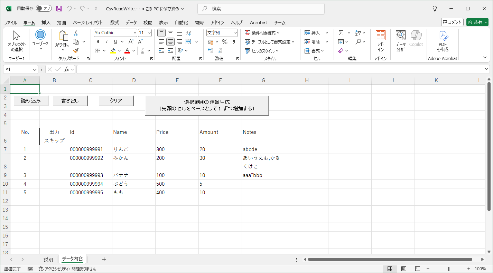

# CsvReadWrite

## 概要
- Excel で CSV ファイルを読み書きするサンプルです。VBA のマクロを使用しています。

## 使い方
- CsvReadWrite.xlsm が Excel のファイルになります。このファイルだけで動作します。

- [データ内容] シートの [読み込み] ボタンをクリックして CSV ファイルを読み込みます。

- [データ内容] シートの [書き出し] ボタンをクリックして CSV ファイルを出力します。  
  (No. に値がある行が出力されます。ただし、出力スキップに値を入力した行は出力しません)

- [データ内容] シートの [クリア] ボタンをクリックすると、シートのデータをすべてクリアします。

- [データ内容] シートの [選択範囲の連番生成] ボタンをクリックすると、セルの選択範囲に連番を生成します。  
  連番は、先頭のセルをベースとして 1 ずつ増加します。  
  (先頭のセルが数値でなければ、単にコピーするだけになります)

- [データ内容] シートはコピーしたりシート名を変更しても、問題なく動作します。  
  (ActiveSheet を制御対象としているため)

## 注意事項
1. 対応している文字コードは UTF-8 (BOMなし) になります。

2. CSV ファイルの先頭行はタイトル行である必要があります。

3. あまり大きなデータは読み込めません。

## その他 ノウハウ等
- VBA のソースコードは、3000_source フォルダ内の source_1XX フォルダで確認できます。  
  (Excelマクロ抽出ツールで抽出しました。確認用です)

- Excel による自動的な変換 (先頭の 0 がなくなる等) を防ぐため、  
  [データ内容] シートのセルの書式は「文字列」に設定しています。

- 連番生成機能は、Excel のオートフィルでは対応できないような  
  大きな桁数の数値や、先頭に 0 があるような数値でも連番の生成が可能です。  
  (文字列として、右から1文字ずつ処理しているため)

## 開発環境等
- OS：Windows 10
- 言語：VBA
- 開発環境：Excel (Microsoft 365)
- 実行環境：Excel (Microsoft 365)

## 履歴
- 2025-7-13  v1.00  初版
- 2025-7-13  v1.01  TSVファイルも一応対応
- 2025-7-13  v1.02  コメント修正のみ
- 2025-7-13  v1.03  文字コードの定数化等
- 2025-7-13  v1.04  デバッグ
- 2025-7-13  v1.05  連番生成は桁数を増やすこともあるように変更

(2025-7-13)
